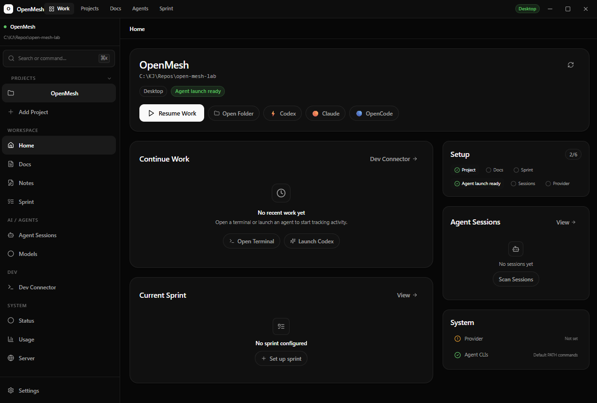

# OpenMesh — Agent Workbench

<p align="center">
  <a href="https://github.com/KJ-AIML/openmesh-agent-workbench/releases/latest">
    
  </a>
  <a href="https://github.com/KJ-AIML/openmesh-agent-workbench/releases">
    
  </a>
  <a href="https://github.com/KJ-AIML/openmesh-agent-workbench/blob/main/LICENSE">
    
  </a>
  <a href="https://tauri.app">
    
  </a>
  <a href="https://vuejs.org">
    
  </a>
  <a href="https://www.rust-lang.org">
    
  </a>
</p>

<p align="center">
  <strong>Local-first desktop agent workbench for managing projects, terminals, AI agent CLIs, command presets, work snapshots, notes, sessions, and sprint context.</strong>
</p>

---

<p align="center">
  
</p>

---

## Features

<div align="center">

| | | |
|---|---|---|
| 🗂️ **Project Workspaces** | 🖥️ **Terminal Integration** | 🤖 **Agent Launchers** |
| ⌨️ **Command Palette** | 📸 **Work Snapshots** | 🕐 **Recent Work Memory** |
| 💾 **File-based Storage** | 🎨 **Dark Desktop Shell** | 📋 **Sprint Context** |

</div>

- **Local-first** — all data stays on your machine, no cloud sync
- **Zero-config agent launch** — runs `codex`, `claude`, `opencode` from PATH
- **Custom frameless window** — native-feeling dark desktop shell
- **File-based storage** — `~/.openmesh/` global + `<project>/.openmesh/` per-project
- **Git-aware** — shows branch status, clean/dirty state, auto-detects repos

## Quick Start

```bash
# Clone the repo
git clone https://github.com/KJ-AIML/openmesh-agent-workbench.git
cd openmesh-agent-workbench/web-demo

# Install dependencies
npm install

# Run in development mode
npm run tauri:dev
```

## Install

Download the latest Windows installer from [Releases](https://github.com/KJ-AIML/openmesh-agent-workbench/releases/latest).

| Format | File | Description |
|--------|------|-------------|
| `.exe` | NSIS Installer | Recommended for most users |
| `.msi` | Windows Installer | For enterprise / managed installs |

> **Note:** This preview build is unsigned. Windows may show a SmartScreen / Unknown Publisher warning. Click **"More info"** → **"Run anyway"** to proceed.

## Agent CLI Support

OpenMesh launches agent CLIs from PATH by default — no configuration required:

| Agent | Command | Override in Settings |
|-------|---------|---------------------|
| **Codex** | `codex` | Optional |
| **Claude Code** | `claude` | Optional |
| **OpenCode** | `opencode` | Optional |

Custom command overrides are available in Settings if you need a specific binary path.

## Development

```bash
# Install dependencies
npm install

# Run in development mode (Tauri + Vite hot reload)
npm run tauri:dev

# Frontend only (browser at localhost:3000)
npm run dev
```

## Build

```bash
# Full build (frontend + native binary + installer)
npm run tauri:build
```

Build artifacts are output to `src-tauri/target/release/bundle/`:

```
bundle/
├── nsis/OpenMesh_0.1.0_x64-setup.exe
└── msi/OpenMesh_0.1.0_x64_en-US.msi
```

## Project Structure

```
web-demo/
├── src/                  # Vue 3 frontend
│   ├── pages/            # Route pages (Home, Projects, Settings, etc.)
│   ├── lib/              # Store, adapters, utilities
│   └── components/       # Shared components
├── src-tauri/            # Rust backend (Tauri v2)
│   ├── src/              # Rust source (commands, storage, git)
│   └── Cargo.toml
├── docs/                 # Internal docs and release notes
└── db/                   # Legacy database files (deprecated)
```

## Storage

OpenMesh uses file-based storage:

- **Global config:** `~/.openmesh/settings.json`
- **Per-project data:** `<project>/.openmesh/` (tasks, sessions, notes, snapshots)

All data is stored locally. No cloud sync.

## Current Status

> [!NOTE]
> OpenMesh is early preview software (`0.x` = unstable/early). The current release is intended for local dogfooding and Windows-first testing.

### Known Limitations

- Windows-first build (macOS/Linux not tested)
- No embedded terminal (opens external terminal window)
- No auto-paste into terminal
- No cloud sync
- No code-signed installer

## License

MIT

---

<div align="center">

**[Download Latest Release](https://github.com/KJ-AIML/openmesh-agent-workbench/releases/latest)** · **[Report Issue](https://github.com/KJ-AIML/openmesh-agent-workbench/issues)** · **[Discussions](https://github.com/KJ-AIML/openmesh-agent-workbench/discussions)**

Made with ❤️ by [KJ-AIML](https://github.com/KJ-AIML)

</div>
