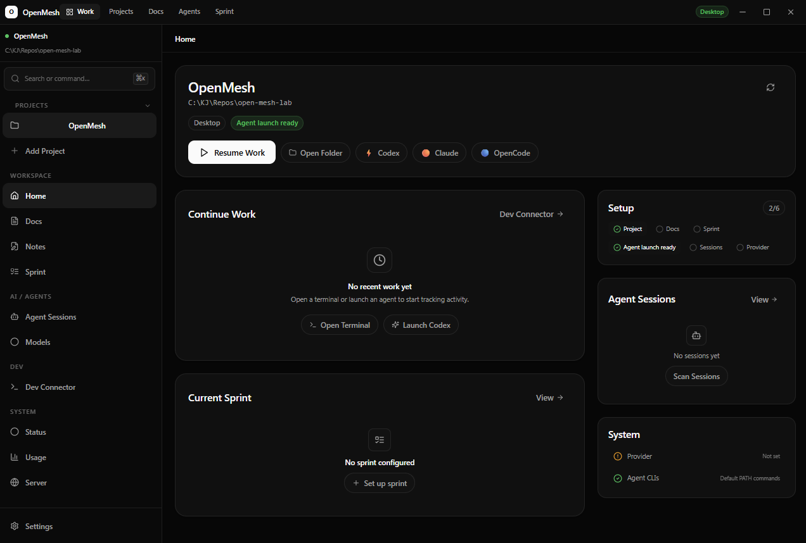

# OpenMesh — Agent Workbench

<p align="center">
  <a href="https://github.com/KJ-AIML/openmesh-agent-workbench/releases/latest">
    
  </a>
  <a href="https://github.com/KJ-AIML/openmesh-agent-workbench/releases">
    
  </a>
  <a href="https://github.com/KJ-AIML/openmesh-agent-workbench/blob/main/LICENSE">
    
  </a>
  <a href="https://tauri.app">
    
  </a>
  <a href="https://vuejs.org">
    
  </a>
  <a href="https://www.rust-lang.org">
    
  </a>
</p>

<p align="center">
  <strong>OpenMesh is a local-first Agent Workbench for developers.</strong><br />
  Project-centric workflow · Agent Chat work surface · Multi-session interoperability · Confined tools & embedded PTY · Human-gated patch authority · Continuity work provenance · Unified provider runtime · Optional OpenAI-compatible HTTP proxy.
</p>

<p align="center">
  <a href="./docs/README.md"><strong>📚 Docs index (start here)</strong></a>
  ·
  <a href="./docs/PRODUCT_GUIDE.md">Product guide</a>
  ·
  <a href="./docs/LIMITATIONS.md">Limitations</a>
  ·
  <a href="./docs/DEVELOPMENT.md">Development</a>
</p>

---

<p align="center">
  
</p>

---

## Core Workbench Surfaces

OpenMesh organizes local-first engineering around four cohesive groups:

| Group | Surface | What you get |
|-------|---------|----------------|
| **Agents** | **Agent Chat** | **Primary work surface** — Ask / Plan / Act / Delegate modes · `/` command tools · `@` context mentions · durable chats · Stop · human-gated patch review & apply · embedded PTY terminal |
| **Agents** | **Sessions** | External agent scanner — Codex, Claude Code, OpenCode, Cursor, Gemini, Grok · Continue in Chat · Resume in external CLI terminal |
| **Workspace** | **Project Core** | Home · Context search & indexing · Docs markdown editor · Notes scratchpad · Canvas Auto UI (`openmesh.canvas/1`) & Excalidraw boards · Sprint backlog & tasks |
| **Runtime** | **Provider Runtime** | Direct OpenAI-compatible execution for Agent Chat · Optional built-in HTTP proxy listener (`localhost:8317`) for external clients · Connection credentials in secure OS keychain |
| **Runtime** | **Pending & LAN** | Continuity work provenance — WorkSignal recording · pending questions & return digest · authenticated peer pairing · same-LAN live ask & message relay |
| **Settings** | **Preferences** | App preferences — theme & appearance · CLI launcher paths · custom tools & dangerous presets · local data & update checker |

Honest boundaries (no WAN mesh, no WhatsApp, no finished E2E crypto, unsigned previews): **[docs/LIMITATIONS.md](./docs/LIMITATIONS.md)**.

---

## Quick Start

```bash
git clone https://github.com/KJ-AIML/openmesh-agent-workbench.git
cd openmesh-agent-workbench   # repo root — there is no web-demo/ folder
npm install
npm run tauri:dev
```

Frontend-only (limited — no PTY / most IPC): `npm run dev` → `http://localhost:3000`.

Full commands: **[docs/DEVELOPMENT.md](./docs/DEVELOPMENT.md)**.

---

## Install

Download from [Releases](https://github.com/KJ-AIML/openmesh-agent-workbench/releases/latest). CI builds macOS / Windows / Linux installers on `v*` tags.

| Your machine | Download |
|--------------|----------|
| Apple Silicon Mac (M1+) | `OpenMesh_*_aarch64.dmg` |
| Intel Mac | `OpenMesh_*_x64.dmg` |
| Windows | `OpenMesh_*_x64-setup.exe` (or `.msi`) |
| Linux | `.deb` / `.AppImage` / `.rpm` |

> **Unsigned preview builds.** macOS often shows **“OpenMesh is damaged and can’t be opened”** after installing from the DMG — that is Gatekeeper quarantine, not a broken file. Clear it, then open:
>
> ```bash
> xattr -cr /Applications/OpenMesh.app
> open /Applications/OpenMesh.app
> ```
>
> Or right-click → **Open** → **Open**. Repo helper: [`scripts/macos-unquarantine.sh`](./scripts/macos-unquarantine.sh).  
> Windows may show SmartScreen → **More info → Run anyway**. Details: [docs/LIMITATIONS.md](./docs/LIMITATIONS.md) · signing follow-up: [docs/DEVELOPMENT.md](./docs/DEVELOPMENT.md#release).

---

## Agent support

| Surface | Agents |
|---------|--------|
| **Agent Engine (Chat)** | Any OpenAI-compatible API (configure in Settings → Provider) |
| **Session scan** | Codex, Claude Code, OpenCode, Cursor, Gemini, Grok |
| **External CLI launch / resume** | Codex, Claude Code, OpenCode (PATH or Settings override) |

---

## Project structure

```
.
├── src/                  # Vue 3 frontend
├── src-tauri/            # Tauri v2 desktop shell
├── crates/
│   ├── openmesh-core/    # Domain, storage, LAN, agent engine
│   └── openmesh-cli/     # CLI over core
├── docs/                 # Product + capability documentation
├── catalog/skills/       # Builtin skill packs
├── plugins/              # Sample plugins
├── tests/ · e2e/         # Vitest · Playwright
└── package.json
```

---

## Storage

| Kind | Location |
|------|----------|
| Global | `~/.openmesh/` |
| Per-project | `<project>/.openmesh/` |
| Agent API key | `{OS config dir}/openmesh/agent-api-key` (never in project JSON) |

No cloud sync.

---

## Current status

> [!NOTE]
> OpenMesh is in release preparation for **v0.2.0-rc.2**. Intended for local developer dogfooding. See [docs/PRODUCT_GUIDE.md](./docs/PRODUCT_GUIDE.md) and [CHANGELOG.md](./CHANGELOG.md).

### Known limitations (summary)

- Agent Engine response model is non-streaming
- Direct provider for Chat; built-in HTTP proxy listener is optional infrastructure
- Trusted-LAN alpha only — no WAN/NAT, bearer pairing rather than E2E identity
- Unsigned preview installers (macOS Gatekeeper / Windows SmartScreen)
- Desktop app required for PTY and native system features

Full list: **[docs/LIMITATIONS.md](./docs/LIMITATIONS.md)**.

---

## License

MIT

---

<div align="center">

**[Docs](./docs/README.md)** · **[Download](https://github.com/KJ-AIML/openmesh-agent-workbench/releases/latest)** · **[Issues](https://github.com/KJ-AIML/openmesh-agent-workbench/issues)** · **[Discussions](https://github.com/KJ-AIML/openmesh-agent-workbench/discussions)**

</div>
